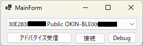

# NerumAppBle

スマートベッド Nerum app を BLE経由で操作する試作アプリ

* 指定したBluetoothAddressに接続

  

* 任意の操作と状態の表示

   

* Debug用 Notification/Writeを出力

  

* 操作毎のコマンドの中身は[Qiitaの記事](https://qiita.com/HiroyukiSakoh/items/47c5e54835e0cae41119)で解説しています  
# BleExample
.NET 6 C# で BLE [アドバタイズの受信](./BleExample/%E3%82%A2%E3%83%89%E3%83%90%E3%82%BF%E3%82%A4%E3%82%BA%E5%8F%97%E4%BF%A1%E3%82%B5%E3%83%B3%E3%83%97%E3%83%AB.cs)と、[GATT サービス・キャラクタリスティックの列挙](./BleExample/%E3%82%B5%E3%83%BC%E3%83%93%E3%82%B9%E3%81%A8%E3%82%AD%E3%83%A3%E3%83%A9%E3%82%AF%E3%82%BF%E3%83%AA%E3%82%B9%E3%83%86%E3%82%A3%E3%83%83%E3%82%AF%E3%81%AE%E5%88%97%E6%8C%99%20.cs)のサンプル実装